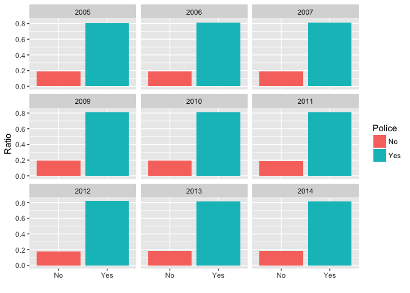
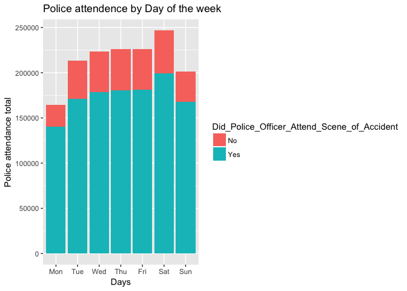
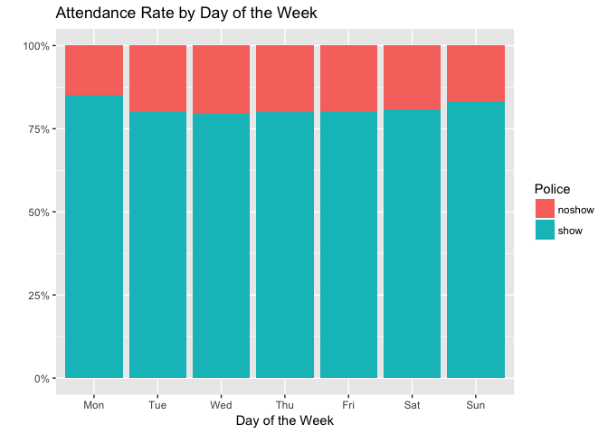
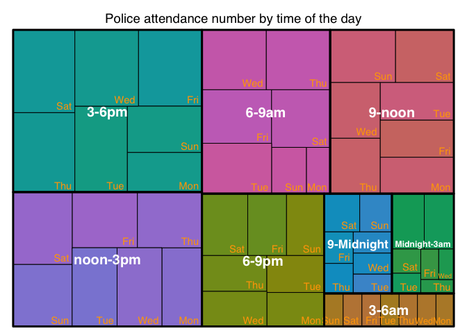
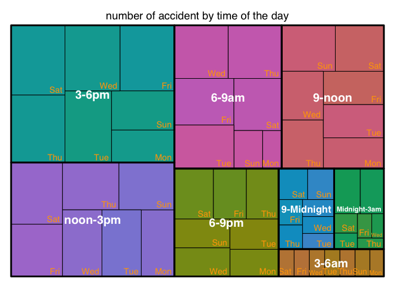

1. Overall trend by year

Convert to %/ratio beforehand and then use it to get the position of the text label

<!-- -->

The figures look almost identical on the 0-1 ratio scale. 

Line graph to show trend overtime.

<!-- -->

In recent year, the attendance rate increased slightly.

Overall between 0.8-0.82. Year is not very interesting.

Next, aggregate all data and look at:

Is day of the week affects attendance rate?

<!-- --><!-- -->
Dig deeper:

Does time of the day matter?
<!-- -->

Does this pattern match the pattern for the overall number of accident?

<!-- --><!--html_preserve-->

<!--/html_preserve-->
