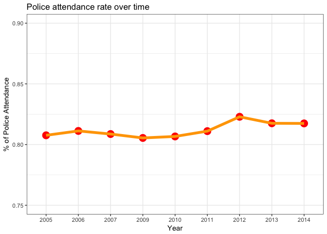
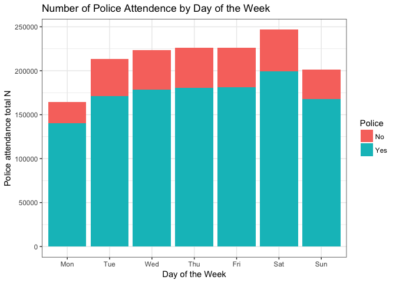

```
Warning in bind_rows_(x, .id): Unequal factor levels: coercing to character
```

```
Warning in bind_rows_(x, .id): binding character and factor vector,
coercing into character vector

Warning in bind_rows_(x, .id): binding character and factor vector,
coercing into character vector
```

```
Warning in bind_rows_(x, .id): Unequal factor levels: coercing to character
```

```
Warning in bind_rows_(x, .id): binding character and factor vector,
coercing into character vector

Warning in bind_rows_(x, .id): binding character and factor vector,
coercing into character vector

Warning in bind_rows_(x, .id): binding character and factor vector,
coercing into character vector
```

```
Warning in bind_rows_(x, .id): Unequal factor levels: coercing to character
```

```
Warning in bind_rows_(x, .id): binding character and factor vector,
coercing into character vector

Warning in bind_rows_(x, .id): binding character and factor vector,
coercing into character vector

Warning in bind_rows_(x, .id): binding character and factor vector,
coercing into character vector
```


```
Warning in .parse_hms(..., order = "HM", quiet = quiet): Some strings
failed to parse, or all strings are NAs
```

1. Overall trend by year

<!-- -->

2. Attempt 2. Convert to %/ratio beforehand and then use it to get the position of the text label

<!-- -->

attempt 3

<!-- -->

Not very interesting all between 0.8-0.82, year is not that important

aggregate all data 

Is day of the week affects attendance rate?

<!-- --><!-- -->

<!-- -->

Does pattern match overall number of accident?

<!-- --><!--html_preserve--><div id="htmlwidget-c3ba49cfd14feb93380f" style="width:672px;height:480px;" class="d3tree html-widget"></div>
<script type="application/json" data-for="htmlwidget-c3ba49cfd14feb93380f">{"x":{"data":{"name":"Overall","id":1,"size":null,"children":[{"name":"(12,15]","color":"#D3A362","h":0.453646392539624,"id":2,"size":298297,"stdErr":298297,"vColor":7,"vSize":298297,"w":0.43804459627263,"x0":0,"y0":0,"children":[{"name":"1","color":"#C18348","h":0.265206030778092,"id":3,"size":35401,"stdErr":35401,"vColor":1,"vSize":35401,"w":0.0889240097493919,"x0":0.349120586523238,"y0":0},{"name":"2","color":"#B78933","h":0.265206030778092,"id":4,"size":41983,"stdErr":41983,"vColor":1,"vSize":41983,"w":0.105457379772004,"x0":0.243663206751234,"y0":0},{"name":"3","color":"#BF8543","h":0.265206030778092,"id":5,"size":42095,"stdErr":42095,"vColor":1,"vSize":42095,"w":0.105738713324501,"x0":0.137924493426733,"y0":0},{"name":"4","color":"#B48A2D","h":0.188440361761532,"id":6,"size":42730,"stdErr":42730,"vColor":1,"vSize":42730,"w":0.15105874308976,"x0":0.137924493426733,"y0":0.265206030778092},{"name":"5","color":"#BC863D","h":0.208133581202873,"id":7,"size":43092,"stdErr":43092,"vColor":1,"vSize":43092,"w":0.137924493426733,"x0":0,"y0":0},{"name":"6","color":"#B18B28","h":0.245512811336751,"id":8,"size":50831,"stdErr":50831,"vColor":1,"vSize":50831,"w":0.137924493426733,"x0":0,"y0":0.208133581202873},{"name":"7","color":"#BA8738","h":0.188440361761532,"id":9,"size":42165,"stdErr":42165,"vColor":1,"vSize":42165,"w":0.149061359756137,"x0":0.288983236516493,"y0":0.265206030778092}]},{"name":"(15,18]","color":"#00C1BA","h":0.546353607460376,"id":10,"size":359257,"stdErr":359257,"vColor":7,"vSize":359257,"w":0.43804459627263,"x0":0,"y0":0.453646392539624,"children":[{"name":"1","color":"#00A6AB","h":0.129453099023224,"id":11,"size":32814,"stdErr":32814,"vColor":1,"vSize":32814,"w":0.168862659685554,"x0":0.269181936587075,"y0":0.453646392539624},{"name":"2","color":"#00A89D","h":0.285247343355708,"id":12,"size":53392,"stdErr":53392,"vColor":1,"vSize":53392,"w":0.124692830729979,"x0":0.144489105857097,"y0":0.453646392539624},{"name":"3","color":"#00A7A8","h":0.261106264104668,"id":13,"size":57827,"stdErr":57827,"vColor":1,"vSize":57827,"w":0.147536771084913,"x0":0.144489105857097,"y0":0.738893735895332},{"name":"4","color":"#00A898","h":0.268674611363161,"id":14,"size":58274,"stdErr":58274,"vColor":1,"vSize":58274,"w":0.144489105857097,"x0":0,"y0":0.453646392539624},{"name":"5","color":"#00A7A4","h":0.261106264104668,"id":15,"size":57232,"stdErr":57232,"vColor":1,"vSize":57232,"w":0.14601871933062,"x0":0.29202587694201,"y0":0.738893735895332},{"name":"6","color":"#00A894","h":0.277678996097215,"id":16,"size":60227,"stdErr":60227,"vColor":1,"vSize":60227,"w":0.144489105857097,"x0":0,"y0":0.722321003902785},{"name":"7","color":"#00A8A0","h":0.155794244332484,"id":17,"size":39491,"stdErr":39491,"vColor":1,"vSize":39491,"w":0.168862659685554,"x0":0.269181936587075,"y0":0.583099491562848}]},{"name":"(18,21]","color":"#E68ECF","h":0.429645620099626,"id":18,"size":180373,"stdErr":180373,"vColor":7,"vSize":180373,"w":0.279671391344882,"x0":0.43804459627263,"y0":0,"children":[{"name":"1","color":"#C872C1","h":0.108169776448052,"id":19,"size":21227,"stdErr":21227,"vColor":1,"vSize":21227,"w":0.130728293188926,"x0":0.586987694428586,"y0":0},{"name":"2","color":"#D06FB5","h":0.12052213608955,"id":20,"size":23651,"stdErr":23651,"vColor":1,"vSize":23651,"w":0.130728293188926,"x0":0.586987694428586,"y0":0.108169776448052},{"name":"3","color":"#CA71BE","h":0.11390987128176,"id":21,"size":25468,"stdErr":25468,"vColor":1,"vSize":25468,"w":0.148943098155956,"x0":0.43804459627263,"y0":0},{"name":"4","color":"#D26FB1","h":0.200953707562023,"id":22,"size":26114,"stdErr":26114,"vColor":1,"vSize":26114,"w":0.0865693745386687,"x0":0.631146613078843,"y0":0.228691912537602},{"name":"5","color":"#CD70BB","h":0.200953707562023,"id":23,"size":26763,"stdErr":26763,"vColor":1,"vSize":26763,"w":0.0887208459362178,"x0":0.542425767142625,"y0":0.228691912537602},{"name":"6","color":"#D36FAE","h":0.200953707562023,"id":24,"size":31487,"stdErr":31487,"vColor":1,"vSize":31487,"w":0.104381170869996,"x0":0.43804459627263,"y0":0.228691912537602},{"name":"7","color":"#CE6FB8","h":0.114782041255843,"id":25,"size":25663,"stdErr":25663,"vColor":1,"vSize":25663,"w":0.148943098155956,"x0":0.43804459627263,"y0":0.11390987128176}]},{"name":"(21,24]","color":"#A1B453","h":0.320769873451325,"id":26,"size":71657,"stdErr":71657,"vColor":7,"vSize":71657,"w":0.148816796828292,"x0":0.717715987617512,"y0":0.1088757466483,"children":[{"name":"1","color":"#789C29","h":0.0678738299663901,"id":27,"size":8638,"stdErr":8638,"vColor":1,"vSize":8638,"w":0.084780846173496,"x0":0.781751938272308,"y0":0.238494489311599},{"name":"2","color":"#8B9815","h":0.0623499468376134,"id":28,"size":7935,"stdErr":7935,"vColor":1,"vSize":7935,"w":0.084780846173496,"x0":0.781751938272308,"y0":0.1088757466483},{"name":"3","color":"#7D9C24","h":0.0672687958256848,"id":29,"size":8561,"stdErr":8561,"vColor":1,"vSize":8561,"w":0.084780846173496,"x0":0.781751938272308,"y0":0.171225693485914},{"name":"4","color":"#909711","h":0.0960518817472563,"id":30,"size":9233,"stdErr":9233,"vColor":1,"vSize":9233,"w":0.0640359506547962,"x0":0.717715987617512,"y0":0.1088757466483},{"name":"5","color":"#839A1F","h":0.101440690882432,"id":31,"size":9751,"stdErr":9751,"vColor":1,"vSize":9751,"w":0.0640359506547962,"x0":0.717715987617512,"y0":0.204927628395556},{"name":"6","color":"#94960E","h":0.123277300821637,"id":32,"size":14395,"stdErr":14395,"vColor":1,"vSize":14395,"w":0.0777885104885168,"x0":0.717715987617512,"y0":0.306368319277989},{"name":"7","color":"#87991A","h":0.123277300821637,"id":33,"size":13144,"stdErr":13144,"vColor":1,"vSize":13144,"w":0.0710282863397753,"x0":0.795504498106029,"y0":0.306368319277988}]},{"name":"(3,6]","color":"#5BB5E2","h":0.1088757466483,"id":34,"size":46135,"stdErr":46135,"vColor":7,"vSize":46135,"w":0.282284012382488,"x0":0.717715987617512,"y0":0,"children":[{"name":"1","color":"#00A0C5","h":0.1088757466483,"id":35,"size":6183,"stdErr":6183,"vColor":1,"vSize":6183,"w":0.03783162563262,"x0":0.96216837436738,"y0":0},{"name":"2","color":"#2A9ACD","h":0.1088757466483,"id":36,"size":6662,"stdErr":6662,"vColor":1,"vSize":6662,"w":0.0407624599651487,"x0":0.841031301057561,"y0":0},{"name":"3","color":"#009EC7","h":0.1088757466483,"id":37,"size":6693,"stdErr":6693,"vColor":1,"vSize":6693,"w":0.0409521381787361,"x0":0.800079162878825,"y0":0},{"name":"4","color":"#3B99CF","h":0.1088757466483,"id":38,"size":6646,"stdErr":6646,"vColor":1,"vSize":6646,"w":0.0406645615323294,"x0":0.88179376102271,"y0":0},{"name":"5","color":"#009DCA","h":0.1088757466483,"id":39,"size":6707,"stdErr":6707,"vColor":1,"vSize":6707,"w":0.0410377993074531,"x0":0.759041363571372,"y0":0},{"name":"6","color":"#4797D1","h":0.1088757466483,"id":40,"size":6754,"stdErr":6754,"vColor":1,"vSize":6754,"w":0.0413253759538599,"x0":0.717715987617512,"y0":0},{"name":"7","color":"#129CCC","h":0.1088757466483,"id":41,"size":6490,"stdErr":6490,"vColor":1,"vSize":6490,"w":0.0397100518123409,"x0":0.922458322555039,"y0":0}]},{"name":"(6,9]","color":"#EC929B","h":0.570354379900374,"id":42,"size":246389,"stdErr":246389,"vColor":7,"vSize":246389,"w":0.2877818745757,"x0":0.43804459627263,"y0":0.429645620099626,"children":[{"name":"1","color":"#D07871","h":0.151308307181479,"id":43,"size":11664,"stdErr":11664,"vColor":1,"vSize":11664,"w":0.0513536884198347,"x0":0.674472782428496,"y0":0.429645620099626},{"name":"2","color":"#D47483","h":0.173238610785203,"id":44,"size":41519,"stdErr":41519,"vColor":1,"vSize":41519,"w":0.159657415838937,"x0":0.43804459627263,"y0":0.429645620099626},{"name":"3","color":"#D17776","h":0.21163082959723,"id":45,"size":45778,"stdErr":45778,"vColor":1,"vSize":45778,"w":0.144100266391678,"x0":0.43804459627263,"y0":0.78836917040277},{"name":"4","color":"#D57388","h":0.21163082959723,"id":46,"size":45645,"stdErr":45645,"vColor":1,"vSize":45645,"w":0.143681608184022,"x0":0.582144862664308,"y0":0.78836917040277},{"name":"5","color":"#D3767B","h":0.185484939517941,"id":47,"size":44454,"stdErr":44454,"vColor":1,"vSize":44454,"w":0.159657415838937,"x0":0.43804459627263,"y0":0.602884230884829},{"name":"6","color":"#D5728D","h":0.207415243121665,"id":48,"size":39892,"stdErr":39892,"vColor":1,"vSize":39892,"w":0.128124458736764,"x0":0.597702012111567,"y0":0.580953927281105},{"name":"7","color":"#D3757F","h":0.151308307181479,"id":49,"size":17437,"stdErr":17437,"vColor":1,"vSize":17437,"w":0.0767707703169288,"x0":0.597702012111567,"y0":0.429645620099626}]},{"name":"(9,12]","color":"#53BF82","h":0.570354379900374,"id":50,"size":234738,"stdErr":234738,"vColor":7,"vSize":234738,"w":0.27417352915167,"x0":0.72582647084833,"y0":0.429645620099626,"children":[{"name":"1","color":"#41A354","h":0.12238074741601,"id":51,"size":29816,"stdErr":29816,"vColor":1,"vSize":29816,"w":0.16230174221793,"x0":0.83769825778207,"y0":0.429645620099626},{"name":"2","color":"#00A667","h":0.132182371538274,"id":52,"size":32204,"stdErr":32204,"vColor":1,"vSize":32204,"w":0.16230174221793,"x0":0.83769825778207,"y0":0.552026367515635},{"name":"3","color":"#38A458","h":0.193637806701925,"id":53,"size":32518,"stdErr":32518,"vColor":1,"vSize":32518,"w":0.111871786933739,"x0":0.72582647084833,"y0":0.623241743283286},{"name":"4","color":"#00A66C","h":0.19359612318366,"id":54,"size":32511,"stdErr":32511,"vColor":1,"vSize":32511,"w":0.111871786933739,"x0":0.72582647084833,"y0":0.429645620099626},{"name":"5","color":"#2AA55E","h":0.132670810931301,"id":55,"size":32323,"stdErr":32323,"vColor":1,"vSize":32323,"w":0.16230174221793,"x0":0.83769825778207,"y0":0.684208739053909},{"name":"6","color":"#00A770","h":0.183120450014789,"id":56,"size":35819,"stdErr":35819,"vColor":1,"vSize":35819,"w":0.130305729913803,"x0":0.869694270086197,"y0":0.816879549985211},{"name":"7","color":"#19A562","h":0.183120450014789,"id":57,"size":39547,"stdErr":39547,"vColor":1,"vSize":39547,"w":0.143867799237867,"x0":0.72582647084833,"y0":0.816879549985211}]},{"name":"[0,3]","color":"#B79FEB","h":0.320769873451325,"id":58,"size":64266,"stdErr":64266,"vColor":7,"vSize":64266,"w":0.133467215554196,"x0":0.866532784445804,"y0":0.1088757466483,"children":[{"name":"1","color":"#AC7DD2","h":0.17977607602729,"id":59,"size":18933,"stdErr":18933,"vColor":1,"vSize":18933,"w":0.070157554336376,"x0":0.866532784445804,"y0":0.249869544072335},{"name":"2","color":"#9884D6","h":0.0636797924656905,"id":60,"size":5955,"stdErr":5955,"vColor":1,"vSize":5955,"w":0.0622969851699969,"x0":0.866532784445804,"y0":0.1088757466483},{"name":"3","color":"#A77FD4","h":0.0968601085935017,"id":61,"size":4727,"stdErr":4727,"vColor":1,"vSize":4727,"w":0.0325107923295428,"x0":0.967489207670457,"y0":0.153009435478834},{"name":"4","color":"#9187D7","h":0.0441336888305334,"id":62,"size":4715,"stdErr":4715,"vColor":1,"vSize":4715,"w":0.0711702303841991,"x0":0.928829769615801,"y0":0.1088757466483},{"name":"5","color":"#A281D5","h":0.0968601085935017,"id":63,"size":5621,"stdErr":5621,"vColor":1,"vSize":5621,"w":0.0386594380546562,"x0":0.928829769615801,"y0":0.153009435478834},{"name":"6","color":"#8B88D7","h":0.0773140049583446,"id":64,"size":7230,"stdErr":7230,"vColor":1,"vSize":7230,"w":0.0622969851699969,"x0":0.866532784445804,"y0":0.172555539113991},{"name":"7","color":"#9D83D5","h":0.17977607602729,"id":65,"size":17085,"stdErr":17085,"vColor":1,"vSize":17085,"w":0.0633096612178199,"x0":0.93669033878218,"y0":0.249869544072335}]}]},"meta":{"type":"index","vSize":"accidentbyhour","vColor":null,"stdErr":"accidentbyhour","algorithm":"pivotSize","vpCoorX":[0.0281214848143982,0.971878515185602],"vpCoorY":[0.0196850393700787,0.910314960629921],"aspRatio":1.48351162585094,"range":null,"mapping":[null,null,null],"draw":true},"options":{"id":"id","celltext":"name","valueField":"size"}},"evals":[],"jsHooks":[]}</script><!--/html_preserve-->
